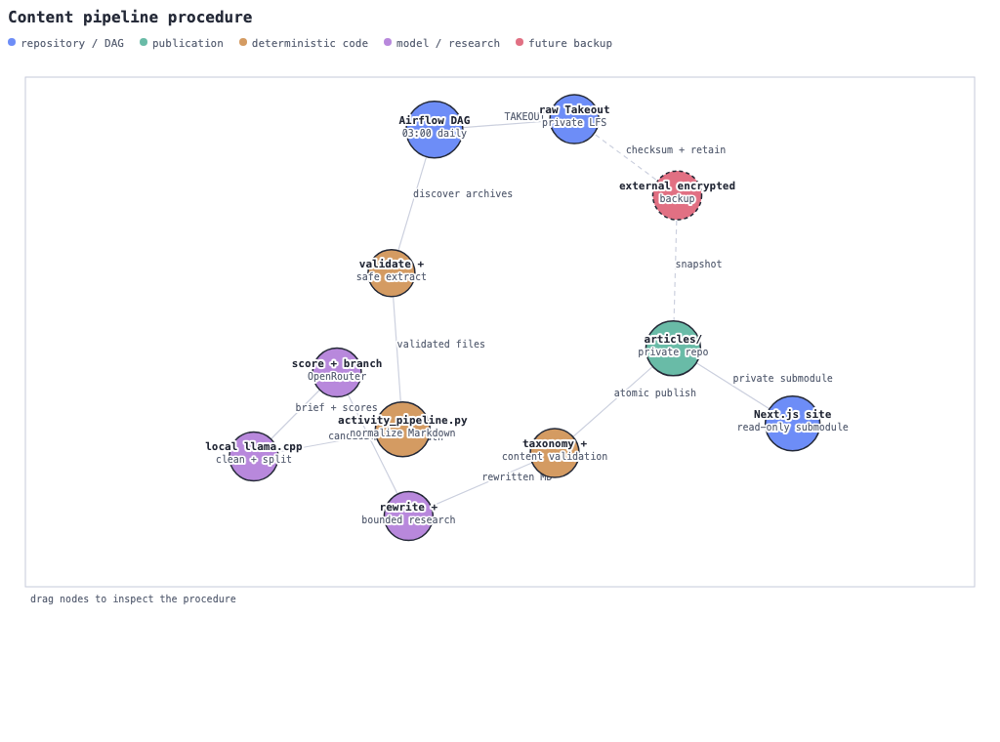

# Content integration boundary

The `content/` directory connects the public site to two independently hosted
repositories. It is an integration boundary, not a third content repository:

- [`articles/`](articles/) is the private
  [UnixGreybeard.Org-Articles](https://github.com/averyfreeman/UnixGreybeard.Org-Articles)
  submodule. It contains published Markdown and the interim `raw-takeout/`
  Google Takeout archive tracked with Git LFS.
- [`pipeline/`](pipeline/) is the public
  [Airflow-AI_Search-to-Blog-Article-Pipeline](https://github.com/averyfreeman/Airflow-AI_Search-to-Blog-Article-Pipeline)
  submodule. It contains the Python workers, Airflow deployment, tests,
  taxonomy, validation, and the optional nested
  [`takeout_downloader_script/`](pipeline/takeout_downloader_script/) submodule.

The parent [UnixGreybeard.Org](https://github.com/averyfreeman/UnixGreybeard.Org)
repository pins both submodules. The parent site reads `articles/` but does not
run `pipeline/`. The pipeline publishes into a private article checkout when
`ARTICLE_PUBLISH_DIR` is configured to that checkout.

## Operating procedure

1. Acquire a Google Takeout archive manually or with the optional downloader.
   The current raw archive is retained in the private article repository under
   `articles/raw-takeout/` with Git LFS.
2. Make the archive available to Airflow through `TAKEOUT_INBOX`. The default
   DAG location is the pipeline workspace `inbox/`; deployments may instead
   mount the private raw-data directory directly.
3. Start the Airflow Compose stack in `pipeline/airflow/`. The scheduled
   `google_takeout_articles` DAG discovers archives, validates them, performs
   safe extraction, and normalizes AI Mode/Gemini Apps activity into Markdown.
4. Deterministic hashes prevent duplicate work. The taxonomy classifier assigns
   one allowlisted category, while deterministic filters remove low-evidence
   and previously completed records.
5. Local `llama.cpp` cleans conversation artifacts, splits oversized topics,
   and creates document briefs. OpenRouter scoring routes each candidate to
   rewrite, review, or rejection.
6. Rewrites use the local model and bounded external research. Required
   frontmatter, category placement, body length, and transcript cleanup are
   validated before publication.
7. Validated articles are atomically written to the private article tree. The
   Next.js site consumes that tree through its read-only submodule and serves
   relative article attachments through `/article-assets/`.
8. The interim Git LFS copy protects the raw archive. The planned durable
   backup job will create encrypted, checksummed snapshots of raw data,
   rewrite originals, state, manifests, and published versions with retention
   and restore testing.

This is a GitHub-compatible raster rendering of the companion D3 procedure
graph. Dashed edges represent the proposed external backup stage.

## Useful references

- [Pipeline operating guide](pipeline/PIPELINE.md)
- [Backup policy](pipeline/docs/BACKUP_POLICY.md)
- [Taxonomy rules](pipeline/docs/TAXONOMY.md)
- [Parent application README](../README.md)
