# Compact bounded YouTube bibliography pipeline

A ten-minute, phrase-only bibliography run with storyboard thumbnails and a timestamped continuation path.

## Compact bounded bibliography pipeline

Captions move through phrase curation, bounded verification, and portable export. A cap returns a continuation timestamp.

```mermaid
flowchart LR
  accTitle: Compact bounded bibliography pipeline
  accDescr: Start with a YouTube URL, retrieve captions, filter from the optional timestamp, extract meaningful multi-word phrases, globally deduplicate them, verify only the shortlist, then show results and a Markdown export. If the ten-minute or forty-hit limit is reached, save the cursor and offer a continuation URL.
  url["YouTube URL"]
  captions["Caption timeline"]
  cursor["Timestamp cursor"]
  phrases["Phrase-only extraction"]
  dedupe["Global dedupe"]
  verify["Bounded verification"]
  results["Results + thumbnails"]
  markdown["Markdown page"]
  cap["Cap&#58; time or 40 hits"]
  url --> captions
  captions --> cursor
  cursor --> phrases
  phrases --> dedupe
  dedupe --> verify
  verify --> results
  results --> markdown
  phrases -.->|limit| cap
  verify -.->|limit| cap
  cap -.->|continue at t=Ns| cursor
%% portable-canonical-v2:eyJhY2Nlc3NpYmlsaXR5IjoiU3RhcnQgd2l0aCBhIFlvdVR1YmUgVVJMLCByZXRyaWV2ZSBjYXB0aW9ucywgZmlsdGVyIGZyb20gdGhlIG9wdGlvbmFsIHRpbWVzdGFtcCwgZXh0cmFjdCBtZWFuaW5nZnVsIG11bHRpLXdvcmQgcGhyYXNlcywgZ2xvYmFsbHkgZGVkdXBsaWNhdGUgdGhlbSwgdmVyaWZ5IG9ubHkgdGhlIHNob3J0bGlzdCwgdGhlbiBzaG93IHJlc3VsdHMgYW5kIGEgTWFya2Rvd24gZXhwb3J0LiBJZiB0aGUgdGVuLW1pbnV0ZSBvciBmb3J0eS1oaXQgbGltaXQgaXMgcmVhY2hlZCwgc2F2ZSB0aGUgY3Vyc29yIGFuZCBvZmZlciBhIGNvbnRpbnVhdGlvbiBVUkwuIiwiZGF0YSI6eyJkaXJlY3Rpb24iOiJMUiIsImVkZ2VzIjpbeyJhcnJvdyI6Ii0tPiIsImZyb20iOiJ1cmwiLCJ0byI6ImNhcHRpb25zIn0seyJhcnJvdyI6Ii0tPiIsImZyb20iOiJjYXB0aW9ucyIsInRvIjoiY3Vyc29yIn0seyJhcnJvdyI6Ii0tPiIsImZyb20iOiJjdXJzb3IiLCJ0byI6InBocmFzZXMifSx7ImFycm93IjoiLS0-IiwiZnJvbSI6InBocmFzZXMiLCJ0byI6ImRlZHVwZSJ9LHsiYXJyb3ciOiItLT4iLCJmcm9tIjoiZGVkdXBlIiwidG8iOiJ2ZXJpZnkifSx7ImFycm93IjoiLS0-IiwiZnJvbSI6InZlcmlmeSIsInRvIjoicmVzdWx0cyJ9LHsiYXJyb3ciOiItLT4iLCJmcm9tIjoicmVzdWx0cyIsInRvIjoibWFya2Rvd24ifSx7ImFycm93IjoiLS4tPiIsImZyb20iOiJwaHJhc2VzIiwibGFiZWwiOiJsaW1pdCIsInRvIjoiY2FwIn0seyJhcnJvdyI6Ii0uLT4iLCJmcm9tIjoidmVyaWZ5IiwibGFiZWwiOiJsaW1pdCIsInRvIjoiY2FwIn0seyJhcnJvdyI6Ii0uLT4iLCJmcm9tIjoiY2FwIiwibGFiZWwiOiJjb250aW51ZSBhdCB0PU5zIiwidG8iOiJjdXJzb3IifV0sIm5vZGVzIjpbeyJpZCI6InVybCIsImxhYmVsIjoiWW91VHViZSBVUkwifSx7ImlkIjoiY2FwdGlvbnMiLCJsYWJlbCI6IkNhcHRpb24gdGltZWxpbmUifSx7ImlkIjoiY3Vyc29yIiwibGFiZWwiOiJUaW1lc3RhbXAgY3Vyc29yIn0seyJpZCI6InBocmFzZXMiLCJsYWJlbCI6IlBocmFzZS1vbmx5IGV4dHJhY3Rpb24ifSx7ImlkIjoiZGVkdXBlIiwibGFiZWwiOiJHbG9iYWwgZGVkdXBlIn0seyJpZCI6InZlcmlmeSIsImxhYmVsIjoiQm91bmRlZCB2ZXJpZmljYXRpb24ifSx7ImlkIjoicmVzdWx0cyIsImxhYmVsIjoiUmVzdWx0cyArIHRodW1ibmFpbHMifSx7ImlkIjoibWFya2Rvd24iLCJsYWJlbCI6Ik1hcmtkb3duIHBhZ2UifSx7ImlkIjoiY2FwIiwibGFiZWwiOiJDYXA6IHRpbWUgb3IgNDAgaGl0cyJ9XX0sImRlc2NyaXB0aW9uIjoiQ2FwdGlvbnMgbW92ZSB0aHJvdWdoIHBocmFzZSBjdXJhdGlvbiwgYm91bmRlZCB2ZXJpZmljYXRpb24sIGFuZCBwb3J0YWJsZSBleHBvcnQuIEEgY2FwIHJldHVybnMgYSBjb250aW51YXRpb24gdGltZXN0YW1wLiIsImlkIjoiYmlibGlvZ3JhcGhlcl9mbG93Iiwia2luZCI6ImZsb3djaGFydCIsInNvdXJjZVNoYTI1NiI6ImMyOTA5N2M0MTk3NGM5OGQyZjlmZjYxZWE3NDlkMmZiN2IyMDBkMTdkYjg4NGQzODdmMTMyMTVkOTMyM2M2MWMiLCJzdHlsZXMiOltdLCJ0aXRsZSI6IkNvbXBhY3QgYm91bmRlZCBiaWJsaW9ncmFwaHkgcGlwZWxpbmUiLCJ2ZXJzaW9uIjoxfQ
```

<!-- mermaid:id=bibliographer_flow -->

